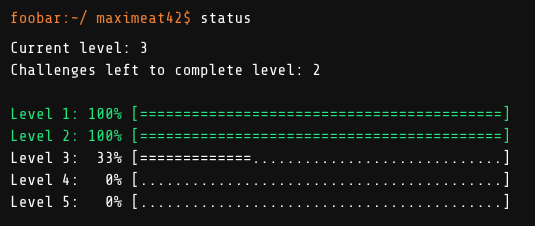
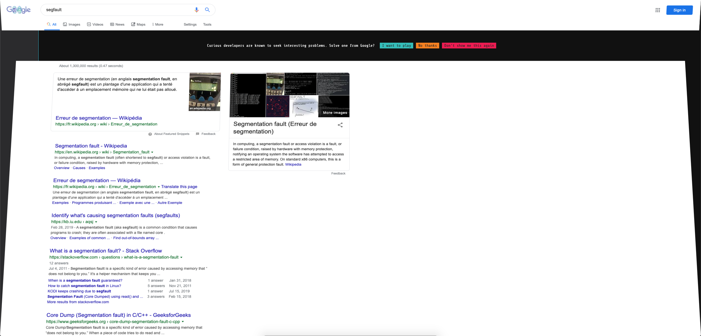
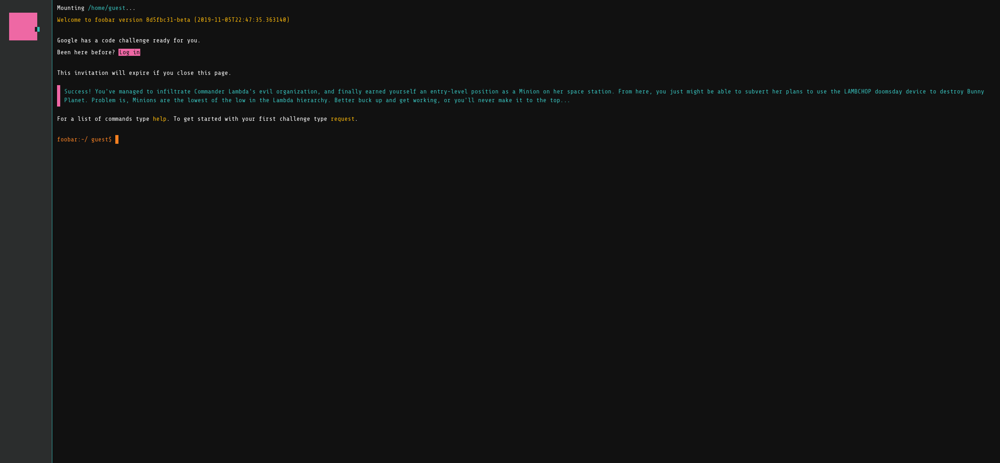
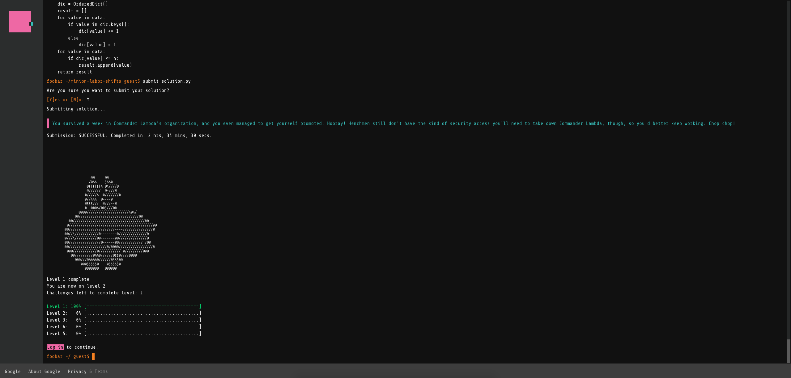

<h1 align="center">Google foobar Challenge</h1>

 
Google foobar est un challenge de programmation cree par Google, il est utilise pour le recrutement de developpeurs au sein de Google. L'entreprise ne communique pas sur celui-ci, c'est la raison pour laquelle vous n'en avez probablement pas entendu parler.

 

	
	 ma progression actuelle

 
Après plusieurs recherches sur les sockets en C, j'ai cherché "segfault", il y eu une animation avec l'invitation au Challenge.

 

	

 
J'ai d'abord cru à un easter egg de Google (comme [google in 1998](https://www.google.fr/search?hl=en&q=google+in+1998&cad=h)).

 

	

 
Je me suis connecté puis le premier exercice a commencé, j'avais 48 pour le réussir. A chaque exercice on a le choix entre Java et Python 2, comme je n'avais jamais fait de python et que j'avais envie d'apprendre j'ai choisi ce langage. J'ai mis un peu près 1h pour réussir, le temps d'apprendre et d'experimenter avec le python.

 

	
	 après avoir validé le 1er exercice

 
Quelques jours plus tard, j'ai lancé le niveau 2, il comptait 2 exercices, 72h pour réaliser chaque exercice, le compte à rebours se lance dès que l'on demande le sujet. Le premier m'a pris 20 minutes, le deuxième environ 40, il n'y avait aucune difficulté. Puis j'ai lancé le 3ème exercice. J'avais 96 heures pour le réussir, cette fois c'était beaucoup plus compliqué. Le but de cet exercice était de d'avoir une fonction qui à partir d'une matrice stochastique donne la probabilité de d'arriver dans un état terminal (voir chaines de markov absorbantes), bien sûr aucun de ces mots de vocabulaire n'était présent dans l'énoncé. Au final après 84 heures (sur les 96 disponibles) j'ai réussis l'exercice ! J'attends d'avoir plus de temps disponible pour faire les 2 derniers exercices du niveau 3.

(je ne posterai aucun code sur ce répo)